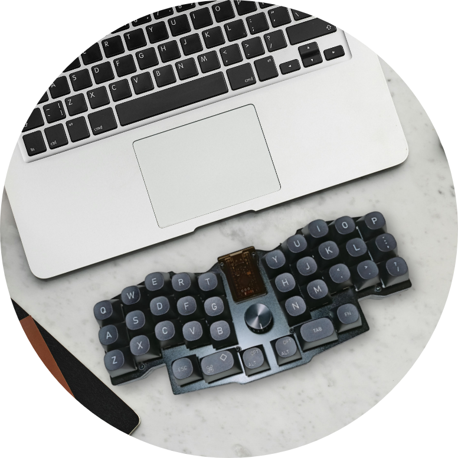
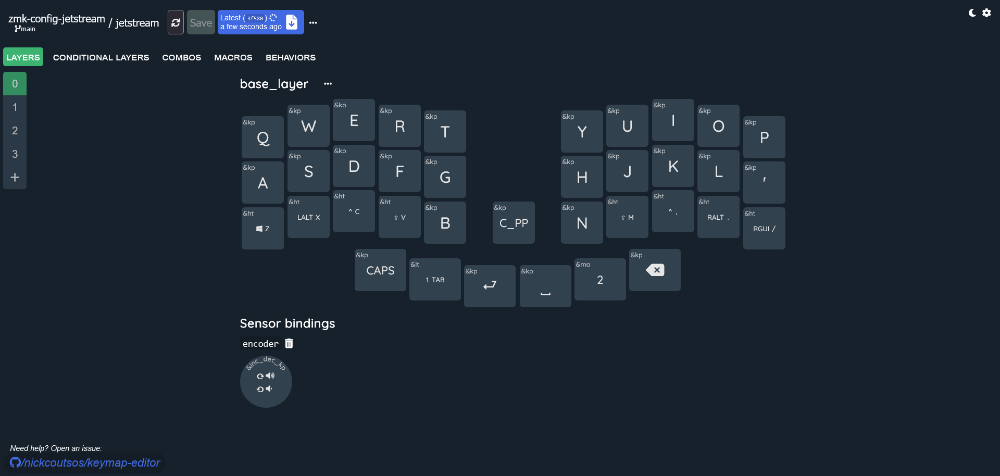

# Jetstream ZMK Config 

 

## Building the Firmware with GitHub Actions

1. Fork the repository https://github.com/ozkan/jetstream-zmk-config  
2. Make changes to the [jetstream.keymap](config/jetstream.keymap) file in your repository.  
3. Commit changes to your repository
4. Go to `Actions`tab in your repository
5. Wait for the GitHub Action to complete
6. Grab `firmware.zip` file (it contains firmware)

## Flash firmware

1. Obtain `firmware.zip`
2. Unzip `firmware.zip`, you should have `jetstream-nice_nano_v2-zmk.uf2` files
3. Connect selected halve to the PC via USB-C cable
4. Press `RESET` button **twice** to enter DFU mode. You should see new USB device in your file manager
5. Copy the corresponding firmware to the root directory of the new USB device

 Your device is now ready to use. Enjoy your enhanced experience! :tada:

--- 
## Tools

### 1. Customize Your Keymap with the Online Editor 

1. Go to the [Keymap Editor](https://nickcoutsos.github.io/keymap-editor/) web app.
2. Log in with your GitHub account.
3. Adjust your keymap to your preference and click "Save".
4. Describe your changes briefly, click "commit", and wait for the firmware build to complete.
5. Download the compiled firmware file.

### 2. Visualize keymap swith the Keymap-Drawer

Keymap drawer: https://keymap-drawer.streamlit.app/

 

[ZMK](https://zmk.dev) : Modern, open source keyboard firmware.